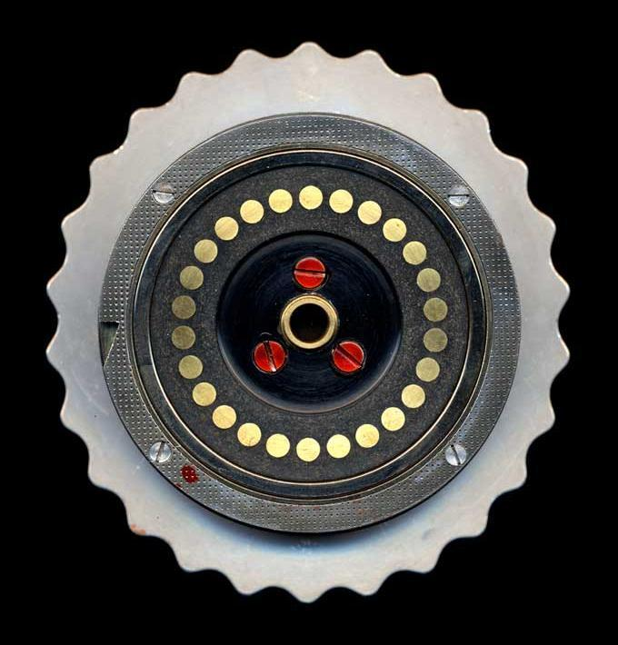

### Enigma

- 字母频率


- 恩格玛密码机


>主要组成部分：
> 1.键盘：输入明文
> 2.灯盘：在键盘上输入一个字母，会有相应的字母亮起来，代表被加密后的字母
> 3.转子：加密的核心，后边会详细讲
> 4.插线板：为提高安全性增加的装置，后边会讲
> 操作方法：
> 1.调整好转子位置（为什么要调整后边会将）
> 2.输入明文，明文对应的密文灯会亮起来。


- 转子


​	转子的一面

​	

​	

​	转子的另一面

​	

> 一个转子代表一个单表替换关系(左边是明文 右边是替换后的密文)
>
> 恩格玛机用了三个转子串连起来

​	

​	

- 反射器


> 性质1:
>
> 加密过程是自反的，也就是输入A输出G，反过来，输入G输出A,这样既可以用来加密也可以用来加密
>
> 性质2:(有很大的缺点)
>
> 一个字母加密后的输出结果不会是自己本身，看上图，因为加密过程是多伦简单的字母替换，一个字母如果加密后要还是自己，在上图中就要A从红线进去，然后从红线再返回来，但是我们使用了反射器，导致A的返回路径是蓝线，所以字母加密后结果不是其本身。

- 插线板

  

  > 将密码数量增大了1000亿倍

  在插线板上刻有26个字母，如果操作员用一条线将其中两个字母连接起来，那么这两个字母在加密过程中会被互换。经过转子加密输出后的字母会再一次通过插线板，然后结果被输出到灯盘上。

- 如何使用

  ​	操作员会收到 一个密码本 包括如下信息

  1. 三个转子的排列顺序（例如三个转子从左至右编号分别为2-3-1）
  2. 三个转子的位置分别对应一个固定的刻度（例如三个转子分别转动到Q-V-M对应到相应的刻度）
  3. 插线板的设置（对哪些字母进行交换）

  > 虽然这种加密方式在当时已经是登峰造极了 但是还是存在漏洞 当密文过长的时候还是会发现规律
  >
  > 于是德国人再发送每条消息前, 随即选取 三个字母作为三个转子的初始刻度(随机 既是操作员脑海中浮现的任意三个字母)

  加密:

  - 1.按照密码本的规定，调整三个转子的顺序，假设为2-1-3
  - 2.按照密码本的规定，转动三个转子到相应的刻度
  - 3.按照密码本的规定，用导线连接相应的字母，实现字母的替换
  - 4.**随机**找三个字母，假设为T,G,S
  - 5.依次输入两边(为了防止输入错)TGS，每次输入完一个字母，记录当前输出，转动一下第一个转子(当第一个转子转动一圈后，第二个转子将会转一格，第三个同理)
  - 6.假设本此输出的六个字母为BMXYUI,将BMXYUI发送出去
  - 7.将三个转子分别拨到T G S位置,开始输入需要加密的正文消息，输入一个字母拨动一下第一个转子，记录输出，这些输出就是密文

  解密:

  - 1.按照密码本的规定，调整三个转子的顺序，假设为2-1-3
  - 2.按照密码本的规定，转动三个转子到相应的刻度
  - 3.按照密码笨的规定，用导线连接相应的字母，实现字母的替换
  - 4.将收到的前六个字母(假设为BMXYUI)输入,由于两边的机器设置都是一样的，于是得到输出序列TGSTGS
  - 5.将三个转子拨动到T G S位置，将收到的密文输入，输入一个 字母***反向拨动***一下第一个转子，记录输出，得到明文

  

- 恩格玛机的破解

  漏洞: 波兰人**雷耶夫斯基**以难以置信的洞察力发现了其中的一个漏洞

  我们想象雷耶夫斯基截取到了一段德军的电文，前六个字母是：HGABLE，他知道这是三个字母连续输入两次恩格玛机的结果，虽然我们不知道这三个字母是什么，但是知道HGABLE中的**第一个字母H**和**第四个字母B**是**同一个字母加密后**的结果，由于转子在期间**转动了三次**，所有同一个字母在两次加密时被替换成了不同的字母，我们可以吧它们组成一对：H - B

  若在一天之内截获到了更多的电报 就可以得到更多的字母 直到26个字母全都对上

  再利用自反性 为了后边方便，我们设定一个规则：A经过转动n次转子后替换后变成成为B描述为：A(n)=B

  当大量截获通信的前六个字母后 可以获得更多的信息 利用上面的推理 可以得到一张(0)(3) 对应的表

  > 但是再二战爆发后 由采取了很多的措施来加强恩格玛机的安全性 使得上面的破解方法失效

  

- Alan Mathison Turing

  ***机器对抗机器*** --- 机器创造出来的密码怪兽 只有机器才能战胜

  首先，英国人需要在密文中确定一条“Crib”。所谓Crib，指的是一段猜测出来的明文与密文中字母的一一对应关系。在密文中猜测出几个单词的明文并不困难，因为循规蹈矩的德国人在信息正文中喜欢用固定的词组，比如Keine besonderen Ereignisse（无特殊情况），Heil  Hitler（希特勒万岁）等。

  另外一个例子是英国人发现德国人喜欢在早上6点钟发送一条天气预报，所以在早上6点钟截获的电文开头中肯定包含wetter（天气）这个词。(在《模仿游戏》中，讲的是希特勒万岁)

  猜出密文中包含的明文单词后，如何精确地确定它们的位置呢？希望你还没有忘记我们前面讲过的恩格玛机的第二个非常非常重要的性质，那就是**一个字母永远不会被替换为自身**。

  根据恩格玛机的这个特性，我们可以把一段明文字母在猜测对应的密文上方**来回移动**进行判断。

  

  在上面这张图片中，明文位置1可以被排除掉，因为在这个位置上明文中的E又被加密成了E，而这是违反恩格玛机特性的。同理，明文位置3也可以被排除掉，因为明文中的R又被加密成了R。排除掉不可能的情况，明文位置2就极有可能是wetter这个单词所处的真实位置。这样我们就得到了一个Crib，其中明文与密文的对应关系如下：

  ```makefile
   明文|W|E|T|T|E|R|
   密文|E|R|K|M|G|W|
  ```

  在上边这个对应关系中，图灵利用其中首尾相接的字母链设计出了可以暴力破解恩格玛机的机器。这段的加密过程为：

  - w->位置0加密->E->位置1加密->R->转子5加密->w  首尾相接了

  我们来详细看一下w->E的加密过程：
   

  当操作员按下W后，如果W上接线和另外一个字母连接了，就替换成另外的那个字母，没有接线就替换，我们记操作员按下W后，没有进入转子之前生成的字母为V1,V1经过三个转子加密生成V2,V2经过插线板(有线替换，没有线就不替换)，输出E

  我们将W-E-R-W这个字母链连接成一张图，用三台恩格玛机串联，如图：
   

  > 解释一下，v2和v3:
  > w经过插线板，转子位置0加密后得到v2,v2经过插线板输出E,这个E作为下一台恩格玛机的输入，经过插线板，当然还是v2,相当于一个反向替换(如果没有线就不替换)，很容易理解,V3同理。

  同理得到W经过插线板没有进转子之前得到V1,则当输出结果为W时，在输出插线板之前转子之后，结果还是V1,所以V1==V4，所以图中，E和R之两边的插线板是多余的，图可以化简为：
   

  ***那么图灵工作的精髓来了***：
  用**三个恩格玛机**的转子串联起来，从刚才我们计算的所有可能中选一种，作为第一个恩格玛机的位置0，第二个恩格玛机相对于第一个偏差1，第三个相当于第一个偏差5，暴力破解者写所有的可能为：
  所有转子可能位置：26X26X26种

  - 转子排列顺序为： A33=6种
  - 5个转子任选3个：C53=10种
  - 总的可能：6*10*26*26*26=1054560种

  每次在V1位置输入A-Z这26个字母，V4位置正好对应这26个字母，那么当前的转子位置0就是德军加密时候设置的位置0。如果有足够多的Crib,甚至可以直接锁定唯一的转子设置，没有的话就是暴力破解者100多万中，机器应该很快，那个时候还没有计算机，以现在的i5也就是秒级别的破解吧。

  > 至于电影提到的在酒吧遇到的一个女的猜测她喜欢的男的有女朋友的片段对图灵的启发应该在于：帮助图灵找到灵感，找到上文中提到的wetter这个单词，电影中用到的是：希特勒万岁。

  我们来看一下这个机器长啥样：
   

  

  #### 致敬！


### Enigma机密码加密解密的实现

##### 题目描述

二战时期，德军使用了一套名为Enigma的密码系统，是一种基于字符映射的密码系统。它的工作原理如下：

使用者从键盘按下一个字母后，字母会先经过三个可以转动的轮盘，称为转子，每个转子就是一个字符映射表。如:

| 输入 | A    | B    | C    | D    | E    |
| ---- | ---- | ---- | ---- | ---- | ---- |
| 输出 | D    | E    | A    | B    | C    |

一个转子的输出作为下一个转子的输入。当经过第三个转子后，输出会被送入到一个反射器。反射器和转子一样，区别在于不能转动，且映射是对称的，即如果输入c1会输出c2，那么输入c2将输出c1。经过反射器后，字母会依次反向进入三个转子，并最终显示在显示盘上。至此算完成了一个字母的加密。当加密下一个字母时，第一个转子会转动一格，转子的转动代表着映射表发生变化。如上表在转动后将变成

| 输入 | A    | B    | C    | D    | E    |
| ---- | ---- | ---- | ---- | ---- | ---- |
| 输出 | E    | A    | B    | C    | D    |

当转子转动一周再次回到**初始位置**时，会带动第二个转子转动一格，同理第二个转动一周后，会带动第三个转子转动。（第三个转子本题中不考虑。）

本题中的三个转子和反射器的结构如下：

转子A：QAZWSXEDCRFVTGBYHNUJMIKOLP

转子B：QWERTYUIOPASDFGHJKLZXCVBNM

转子C：QETUOADGJLZCBMWRYIPSFHKXVN

反射器：ZYXWVUTSRQPONMLKJIHGFEDCBA

使用时三个转子也可拆卸自由**调节顺序**，也就是说加密操作前的初始状态会有26­­*26*26*3!种。

我们用**6位字母**来记录初始状态，并称为**密钥**。

> 1-3位记录三个的转子的排列顺序（如BAC表示B转子放在最靠近键盘的位置）。
>
> 4-6位记录三个转子的初始位置（如XYZ表示最靠近键盘的转子初始位置在X上）。

现在提供你一串密文和密钥，请给出它的原文。


##### 输入

第一行输入整数n(0<n<10000)，代表测试用例的数量。

接下来每个用例由两行组成，第一行由六个大定字母组成，表示密钥。第二行为待解密字符串，由大写字母组成，长度不超过10000。

##### 输出

每一行输出解密后的明文。

##### 样例输入

```
ABCXYZ ZDBSF
```

##### 样例输出

```
HELLO
```

##### 提示

##### 来源

这个模拟题实现方面来说不难，但是题意很难理解。。。。

想必从输入字符依次经过三个转子到反射器的地方大家都能明白，但是从反射器反向经过三个转子的地方有点难理解。

以下是样例中ABCXYZ密钥的字母对照表，方便查看

正常顺序的字母表：

1A 2B 3C 4D 5E 6F 7G 8H 9I 10J 11K 12L 13M 14N 15O 16P 17Q 18R 19S 20T 21U 22V 23W 24X 25Y 26Z 

第一个转子：

1X 2E 3D 4C 5R 6F 7V 8T 9G 10B 11Y 12H 13N 14U 15J 16M 17I 18K 19O 20L 21P 22Q 23A 24Z 25W 26S

第二个转子：

1Y 2U 3I 4O 5P 6A 7S 8D 9F 10G 11H 12J 13K 14L 15Z 16X 17C 18V 19B 20N 21M 22Q 23W 24E 25R 26T

第三个转子：

1Z 2C 3B 4M 5W 6R 7Y 8I 9P 10S 11F 12H 13K 14X 15V 16N 17Q 18E 19T 20U 21O 22A 23D 24G 25J 26L

反射器：

1Z 2Y 3X 4W 5V 6U 7T 8S 9R 10Q 11P 12O 13N 14M 15L 16K 17J 18I 19H 20G 21F 22E 23D 24C 25B 26A

那样例输入的HELLO的H为例，当H经过三个转子传入反射器的时候变为字母X，反射器传出C，此时就要倒推回去。X在反射器中是第3个字母，在正常顺序字母表中第3个字母是C，所以寻找C在第三个转子中的位置，为2。正常顺序中第2个字母为B，所以寻找第二个转子中B的位置，为19。正常顺序第19个字母是S，那么在第一个转子中寻找S，为26。那么正常顺序中第26个字母为Z，因此加密出来的字母是Z

然后就按照题目的意思来，每加密一个字母第一个转子转动一格，第一转子转动一圈带动第二转子。。。。。

以下是我的代码：

```cpp
#include <iostream>
#include <cstring>
#include <cstdio>

using namespace  std;

struct password{
    char name;
    string unit;
};

password a={'A',"QAZWSXEDCRFVTGBYHNUJMIKOLP"};
password b={'B',"QWERTYUIOPASDFGHJKLZXCVBNM"};
password c={'C',"QETUOADGJLZCBMWRYIPSFHKXVN"};

string react="ZYXWVUTSRQPONMLKJIHGFEDCBA",medi,abc="ABCDEFGHIJKLMNOPQRSTUVWXYZ";

void change_first(string &a,char t){
    int i;
    for(i=0;i<26;i++){
        if(a[i]==t){
            medi=a.substr(0,i);
            break;
        }
    }
    a=a.substr(i,26-i);
    a=a+medi;
}
void change1(int &middle,string a){
    char t=a[middle];
    int i;
    for(i=0;i<26;i++){
        if(abc[i]==t){
            middle=i;
            break;
        }
    }
}
void change2(char &re_middle,string a){
    int i;
    for(i=0;i<26;i++){
        if(a[i]==re_middle){
            break;
        }
    }
    re_middle=abc[i];
}

void add1(string &a){

    medi=a.substr(0,1);
    a=a.substr(1,25);
    a=a+medi;
}


int main(){
    int i,j,k,n;
    string t;
    scanf("%d",&n);
    while(n--){
        password sel[3];
        sel[0]=a,sel[1]=b,sel[2]=c;
        string zhuanzi[3];
        cin>>t;
        for(i=0;i<3;i++){
            for(j=0;j<3;j++){
                if(sel[j].name==t[i]){
                    zhuanzi[i]=sel[j].unit;
                    break;
                }
            }
        }
        for(i=0;i<3;i++){
            change_first(zhuanzi[i],t[3+i]);
        }
        cin>>t;
        k=0;
        while(t[k]!='\0'){
            int middle;
            for(i=0;i<26;i++){
                if(abc[i]==t[k]){
                    middle=i;
                    break;

                }
            }

            for(i=0;i<3;i++){
                change1(middle,zhuanzi[i]);


            }
            char re_middle=react[middle];
            for(i=2;i>=0;i--){
                change2(re_middle,zhuanzi[i]);

            }
            cout<<re_middle;
            k++;
            add1(zhuanzi[0]);
            if(k%26==0&&k!=0){
                add1(zhuanzi[1]);

            }
            if(k%(26*26)==0&&k!=0){

                add1(zhuanzi[2]);

            }

        }
        cout<<endl;
    }
    return 0;
}
```